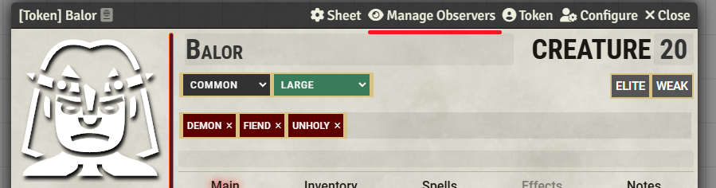
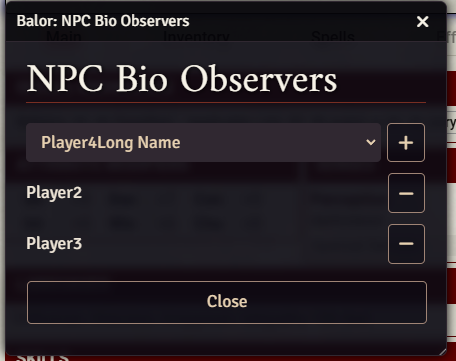
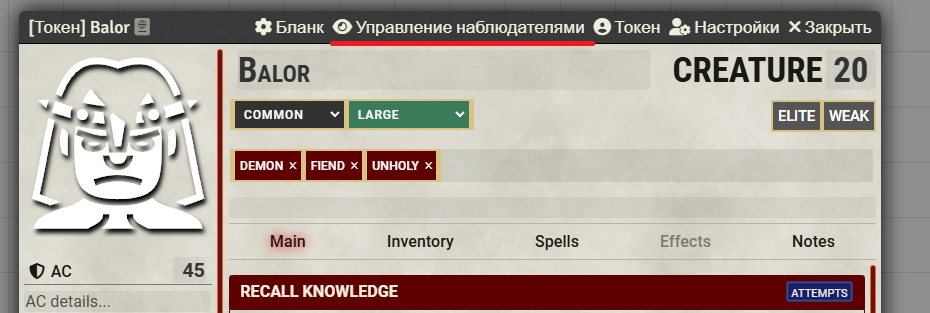
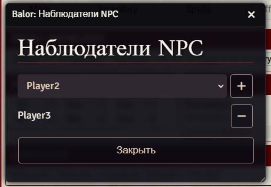

# PF2e NPC Observer

A module for Pathfinder 2e that allows GMs to set players as observers for NPCs, giving them access to NPC art and bio.

---

## English

### Description
PF2e NPC Observer is a Foundry VTT module designed for the Pathfinder 2e system. It allows Game Masters to designate specific players as "observers" for NPCs, granting them access to view the NPC's artwork and biography without giving them full access to the NPC's character sheet.

This is particularly useful for:
- Allowing players to view the appearance of NPCs they've met
- Sharing NPC background information with specific players
- Giving players access to NPC information relevant to their character

### Features
- GMs can designate specific players as observers for any NPC
- Players with observer status can view an NPC's image and biography
- Easy-to-use interface for managing observers
- Context menu option in the Actor Directory for quick access
- Full localization support for English and Russian

### Installation
1. In Foundry VTT, navigate to the "Add-on Modules" tab
2. Click "Install Module"
3. In the "Manifest URL" field, paste: `https://github.com/elfrey/elfrey-pf2-npc-observer/releases/latest/download/module.json`
4. Click "Install"

### Requirements
- Foundry VTT v12 or higher
- Pathfinder 2e system v6.12.2 or higher

### Usage for GMs
1. Enable the module in your world's "Manage Modules" settings
2. Open any NPC sheet
3. Click the "Manage Observers" button in the sheet header

4. Select players from the dropdown and add them as observers

5. Players will now be able to view the NPC's bio and image

### Configuration
The module has a simple configuration option in the Module Settings:
- **Enable Module**: Turns the module functionality on or off

### License
This module is licensed under the [MIT License](LICENSE).

---

## Русский

### Описание
PF2e NPC Observer - это модуль для Foundry VTT, разработанный для системы Pathfinder 2e. Он позволяет Мастерам Игры назначать определенных игроков "наблюдателями" за NPC, предоставляя им доступ к изображению и биографии NPC без предоставления полного доступа к листу персонажа NPC.

Это особенно полезно для:
- Предоставления игрокам возможности видеть внешний вид NPC, с которыми они встречались
- Обмена информацией о предыстории NPC с определенными игроками
- Предоставления игрокам доступа к информации об NPC, имеющей отношение к их персонажу

### Функции
- Мастера могут назначать определенных игроков наблюдателями за любым NPC
- Игроки со статусом наблюдателя могут просматривать изображение и биографию NPC
- Удобный интерфейс для управления наблюдателями
- Опция контекстного меню в Каталоге Актеров для быстрого доступа
- Полная поддержка локализации для английского и русского языков

### Установка
1. В Foundry VTT перейдите на вкладку "Add-on Modules"
2. Нажмите "Install Module"
3. В поле "Manifest URL" вставьте: `https://github.com/elfrey/elfrey-pf2-npc-observer/releases/latest/download/module.json`
4. Нажмите "Install"

### Требования
- Foundry VTT v12 или выше
- Система Pathfinder 2e v6.12.2 или выше

### Использование для Мастеров
1. Включите модуль в настройках "Управление модулями" вашего мира
2. Откройте любой лист NPC
3. Нажмите кнопку "Управление наблюдателями" в заголовке листа
 
 
4. Выберите игроков из выпадающего списка и добавьте их как наблюдателей
 
 
5. Игроки теперь смогут просматривать биографию и изображение NPC

### Конфигурация
Модуль имеет простую опцию конфигурации в Настройках Модуля:
- **Включить модуль**: Включает или выключает функциональность модуля

### Лицензия
Этот модуль лицензирован под [Лицензией MIT](LICENSE).
